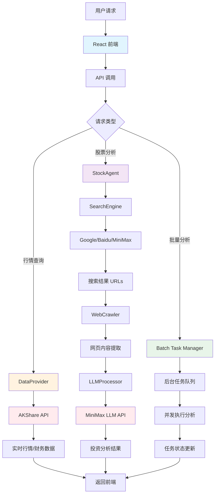
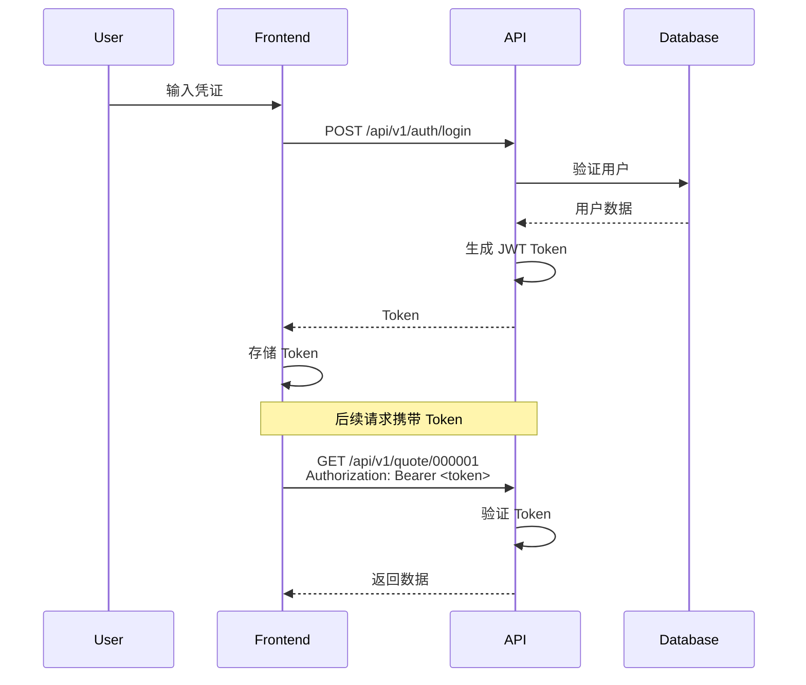

# 系统架构文档

## 概述

Stocks Investment Analysis System 采用前后端分离架构，基于 FastAPI 和 React 构建，整合多种数据源和 AI 能力提供智能投资分析服务。

## 整体架构

```
┌─────────────────────────────────────────────────────────────────────┐
│                        Client Layer (客户端)                        │
│                      React + Ant Design + Vite                      │
└──────────────────────────────────────┬──────────────────────────────┘
                                       │ HTTPS/WebSocket
                                       │
┌──────────────────────────────────────┴──────────────────────────────┐
│                      API Layer (应用层)                              │
│                         FastAPI + Uvicorn                           │
│  ┌─────────────────────────────────────────────────────────────┐  │
│  │                    Middleware Stack                          │  │
│  │  CORS Management → Request Logging → Error Handling          │  │
│  └─────────────────────────────────────────────────────────────┘  │
│                                                                       │
│  ┌──────────┐  ┌──────────┐  ┌──────────┐  ┌──────────┐           │
│  │  Quote   │  │Analysis  │  │  Batch   │  │  Task    │           │
│  │  Routes  │  │  Routes  │  │  Routes  │  │  Routes  │           │
│  └────┬─────┘  └────┬─────┘  └────┬─────┘  └────┬─────┘           │
│       │             │             │             │                  │
└───────┼─────────────┼─────────────┼─────────────┼──────────────────┘
        │             │             │             │
┌───────┼─────────────┼─────────────┼─────────────┼──────────────────┐
│  ┌────▼─────┐  ┌────▼─────┐  ┌────▼─────┐  ┌────▼─────┐           │
│  │AKShare   │  │StockAgent│  │WebCrawler│  │Search    │           │
│  │Provider  │  │          │  │          │  │Engine    │           │
│  └────┬─────┘  └────┬─────┘  └────┬─────┘  └────┬─────┘           │
│       │             │             │             │                  │
└───────┼─────────────┼─────────────┼─────────────┼──────────────────┘
        │             │             │             │
┌───────▼─────────────▼─────────────▼─────────────▼──────────────────┐
│                      External Services (外部服务)                    │
│  ┌─────────────┐  ┌─────────────┐  ┌─────────────┐                │
│  │  AKShare    │  │  MiniMax    │  │  Google/    │                │
│  │  API        │  │  LLM API    │  │  Baidu API  │                │
│  └─────────────┘  └─────────────┘  └─────────────┘                │
└────────────────────────────────────────────────────────────────────┘
```

## 数据流图



## 核心模块

### 1. StockAgent

核心分析引擎，协调各模块完成投资分析。

**职责：**
- 接收分析请求（单股/市场/批量）
- 协调搜索引擎、爬虫和 LLM
- 整合行情数据与分析结果
- 生成结构化投资建议

**关键方法：**
```python
async def analyze_stock(stock_code, stock_name, max_urls, risk_preference)
async def analyze_market(search_queries, max_urls, risk_preference)
async def batch_analyze(stocks, max_urls_per_stock, risk_preference)
async def analyze_stock_stream(...)  # SSE 流式输出
async def analyze_market_stream(...)  # SSE 流式输出
```

### 2. DataProvider

AKShare 数据源封装，提供行情和财务数据。

**职责：**
- 获取 A 股实时行情
- 获取财务指标数据
- 获取 K 线图表数据

**数据模型：**
```python
@dataclass
class StockQuote:
    stock_code: str
    stock_name: str
    current_price: float
    change_percent: float
    volume: int
    timestamp: str

@dataclass
class FinancialData:
    stock_code: str
    pe_ratio: Optional[float]
    pb_ratio: Optional[float]
    roe: Optional[float]
    debt_ratio: Optional[float]
    revenue_growth: Optional[float]
    profit_growth: Optional[float]
```

### 3. SearchEngine

多源搜索引擎，支持回退机制。

**支持引擎：**
- Google 搜索
- 百度搜索
- MiniMax 搜索

**回退策略：**
```
MiniMax → Baidu → Google
Baidu → MiniMax → Google
Google → MiniMax → Baidu
```

### 4. LLMProcessor

MiniMax 大语言模型接口封装。

**功能：**
- 文本分析与总结
- 投资建议生成
- 流式响应支持

### 5. WebCrawler

网页内容提取，基于 Trafilatura。

**功能：**
- 批量 URL 内容抓取
- 并发控制
- 内容清洗与提取

## API 接口

### 健康检查

```http
GET /api/v1/health
```

**响应：**
```json
{
  "success": true,
  "data": {
    "status": "ok",
    "version": "1.0.0",
    "timestamp": "2025-01-15T10:30:00"
  }
}
```

### 行情数据

#### 获取单股行情

```http
GET /api/v1/quote/{stock_code}
```

**响应：**
```json
{
  "success": true,
  "data": {
    "stock_code": "000001",
    "stock_name": "平安银行",
    "current_price": 12.50,
    "change_percent": 1.25,
    "volume": 1000000,
    "timestamp": "2025-01-15T10:30:00"
  }
}
```

#### 批量实时行情

```http
GET /api/v1/quotes/realtime?codes=000001,000002,600000
```

#### 财务数据

```http
GET /api/v1/financials/{stock_code}
```

#### K 线数据

```http
GET /api/v1/kline/{stock_code}?period=daily&adjust=qfq
```

### 股票分析

#### 单股分析

```http
POST /api/v1/analyze/stock
Content-Type: application/json

{
  "stock_code": "000001",
  "stock_name": "平安银行",
  "risk_preference": "medium",
  "max_urls": 10
}
```

**响应：**
```json
{
  "success": true,
  "data": {
    "stock_code": "000001",
    "stock_name": "平安银行",
    "recommendation": "建议买入...",
    "quote": { /* 行情数据 */ },
    "financials": { /* 财务数据 */ },
    "processing_time": 5.2,
    "sources": ["url1", "url2"],
    "risk_preference": "medium",
    "timestamp": "2025-01-15T10:30:00"
  }
}
```

#### 流式分析

```http
POST /api/v1/analyze/stock/stream
Content-Type: application/json

{
  "stock_code": "000001",
  "risk_preference": "medium"
}
```

**SSE 事件类型：**
- `search_start` - 开始搜索
- `search_progress` - 搜索进度
- `analysis_start` - 开始分析
- `analysis_progress` - 分析进度
- `complete` - 分析完成
- `error` - 错误

#### 市场分析

```http
POST /api/v1/analyze/market
Content-Type: application/json

{
  "risk_preference": "medium",
  "max_urls": 15,
  "search_queries": ["A股市场分析", "央行政策"]
}
```

#### 批量分析

```http
POST /api/v1/analyze/batch
Content-Type: application/json

{
  "stocks": [
    {"code": "000001", "name": "平安银行"},
    {"code": "000002", "name": "万科A"}
  ],
  "risk_preference": "medium",
  "max_urls_per_stock": 10
}
```

**响应：**
```json
{
  "success": true,
  "data": {
    "task_id": "uuid",
    "status": "pending",
    "total_count": 2,
    "success_count": 0,
    "error_count": 0
  }
}
```

### 任务管理

#### 获取任务状态

```http
GET /api/v1/tasks/{task_id}
```

**响应：**
```json
{
  "success": true,
  "data": {
    "task_id": "uuid",
    "status": "completed",
    "progress": 1.0,
    "results": [
      {
        "stock_code": "000001",
        "stock_name": "平安银行",
        "recommendation": "...",
        "status": "success"
      }
    ],
    "error": null
  }
}
```

## 数据库设计

当前版本使用内存存储任务状态。生产环境建议使用 Redis 或数据库持久化。

### 推荐表结构 (SQLite/PostgreSQL)

#### users 表

```sql
CREATE TABLE users (
    id INTEGER PRIMARY KEY AUTOINCREMENT,
    username VARCHAR(50) UNIQUE NOT NULL,
    email VARCHAR(100) UNIQUE NOT NULL,
    password_hash VARCHAR(255) NOT NULL,
    created_at TIMESTAMP DEFAULT CURRENT_TIMESTAMP,
    updated_at TIMESTAMP DEFAULT CURRENT_TIMESTAMP
);
```

#### analysis_history 表

```sql
CREATE TABLE analysis_history (
    id INTEGER PRIMARY KEY AUTOINCREMENT,
    user_id INTEGER NOT NULL,
    task_id VARCHAR(100) UNIQUE NOT NULL,
    analysis_type VARCHAR(20) NOT NULL,  -- 'stock' or 'market'
    stock_code VARCHAR(20),
    stock_name VARCHAR(100),
    risk_preference VARCHAR(10),
    recommendation TEXT,
    status VARCHAR(20) NOT NULL,  -- 'pending', 'processing', 'completed', 'error'
    processing_time FLOAT,
    created_at TIMESTAMP DEFAULT CURRENT_TIMESTAMP,
    completed_at TIMESTAMP,
    FOREIGN KEY (user_id) REFERENCES users(id)
);
```

## 认证流程

系统支持 JWT 认证（待实现）。



## 错误处理

统一错误响应格式：

```json
{
  "success": false,
  "error": {
    "code": "ERROR_CODE",
    "message": "错误描述"
  },
  "timestamp": "2025-01-15T10:30:00"
}
```

**常见错误码：**

| 错误码 | 描述 |
|--------|------|
| STOCK_NOT_FOUND | 股票不存在 |
| SERVICE_UNAVAILABLE | 数据服务不可用 |
| ANALYSIS_ERROR | 分析过程出错 |
| TASK_NOT_FOUND | 任务不存在 |
| INTERNAL_ERROR | 内部错误 |
| UNAUTHORIZED | 未授权（认证失败） |
| RATE_LIMIT_EXCEEDED | 请求频率超限 |
